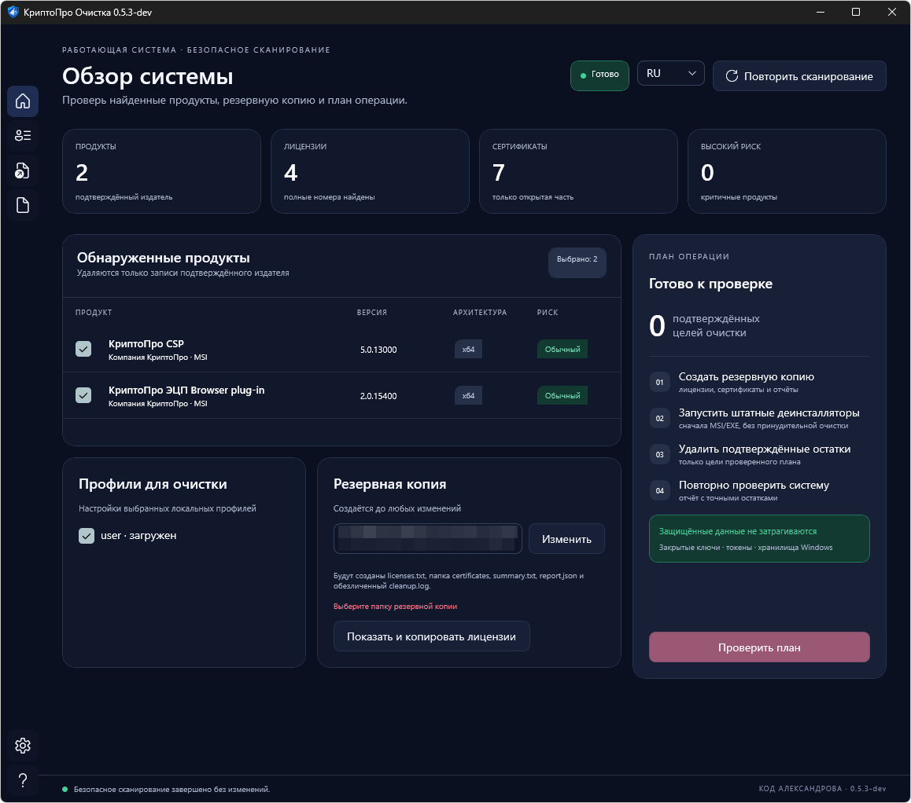
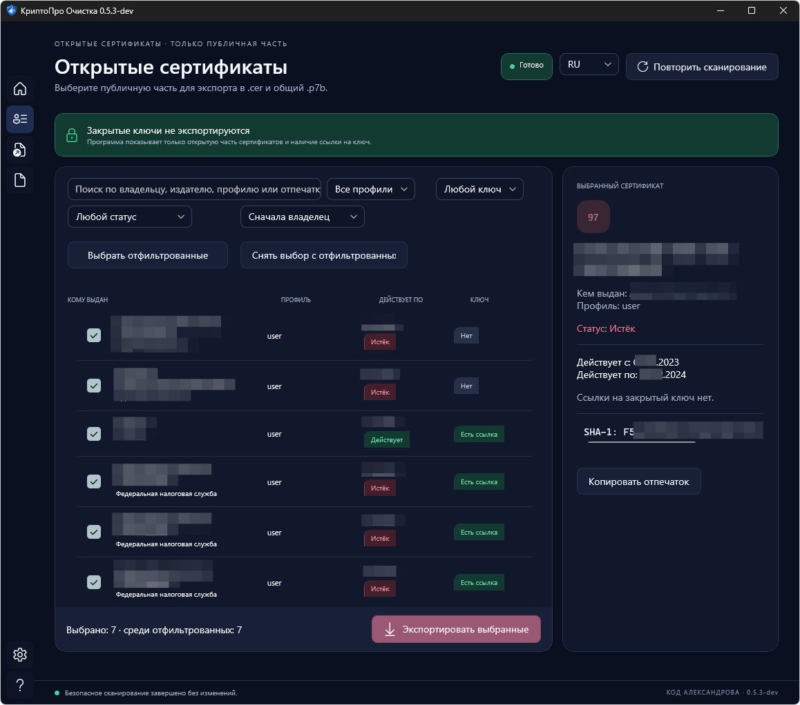
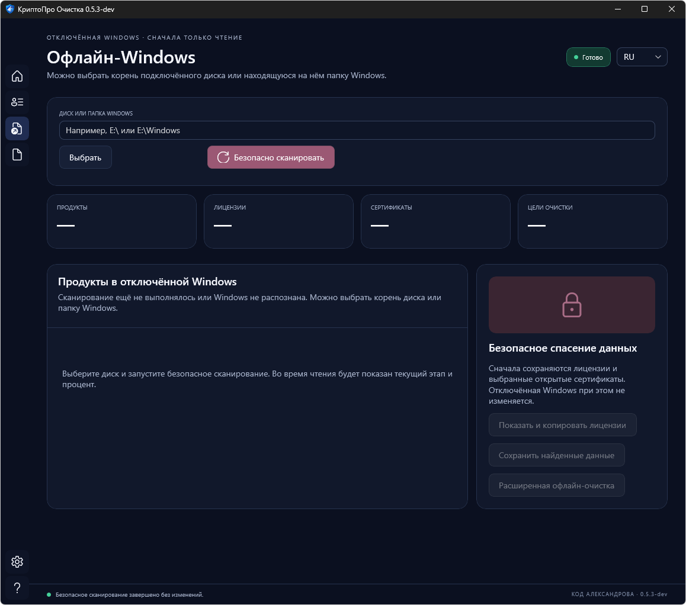
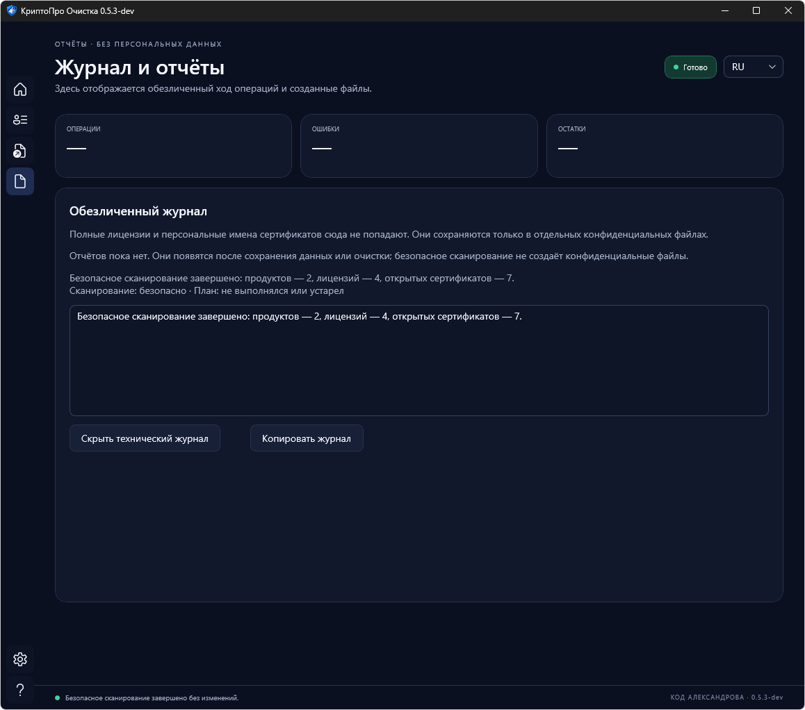
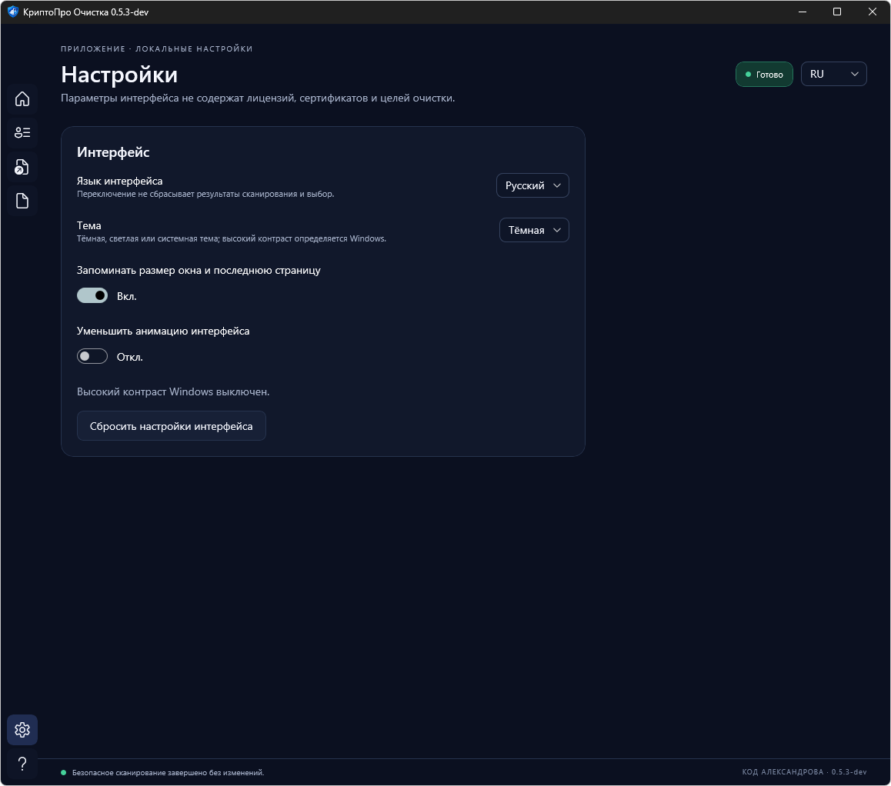
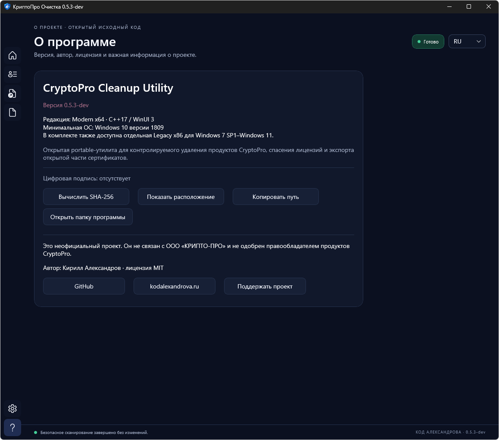

# CryptoPro Cleanup Utility

[](https://github.com/acidtmn/CryptoProCleanup/actions/workflows/build.yml)
[](https://github.com/acidtmn/CryptoProCleanup/releases)
[](LICENSE)
[](#system-requirements)

> **Status: public 0.5.3-rc1 release candidate, not a stable release.** A user previously completed full removal on a live Windows 10 x64 system. Product detection, the complete license, and public-certificate export are confirmed on a real connected Windows 7 x86 disk. The complete Windows/CSP VM matrix remains required before a stable release.

An unofficial portable utility for backing up license identifiers and public certificates, controlled removal of installed CryptoPro products, and rescue from a disconnected Windows 7 SP1 through Windows 11 installation.

This project is not affiliated with Crypto-Pro LLC. CryptoPro names are used only to describe compatibility. The utility neither downloads nor runs `cspclean.exe`.

**[Download the latest build](https://github.com/acidtmn/CryptoProCleanup/releases)** · [Документация на русском](README.md)

<p align="center">
  
</p>

<details>
<summary><strong>More screenshots: certificates, disconnected Windows, reports, settings, and About</strong></summary>

### Public certificates



### Disconnected Windows



### Reports



### Settings



### About



</details>

## Important warning

Removing cryptographic software can affect electronic signatures, Windows sign-in, VPN, EFS, TLS, and access to encrypted data. A public release must pass the VM matrix in [docs/TEST_MATRIX.md](docs/TEST_MATRIX.md). An unsigned executable may trigger SmartScreen.

The current local build is unsigned. About verifies the actual signature state of the running EXE and calculates SHA-256 only on explicit request. The open source and `SHA256SUMS.txt` provide verification for distributed archives.

The utility deliberately preserves Windows certificate stores, hardware tokens, private-key containers, and any object whose CryptoPro ownership cannot be verified.

## Features

- two portable editions with one shared safety core and no .NET dependency: a self-contained Modern x64 folder and one compatible Win32 Legacy executable;
- Modern shell with one spacing system, Dark, Light, and live System modes, system colors under High Contrast, themed dialogs/title bar, sidebar navigation, and separate functional pages;
- native C++/WinUI 3, Per-Monitor V2 DPI, rounded Fluent controls, responsive layouts, and system accessibility in Modern x64;
- original multi-resolution application icon for Explorer, taskbar, window chrome, and UAC;
- resizable/maximizable native window with adaptive tables, system-DPI scaling, and Windows visual styles;
- verified 32/64-bit product discovery by publisher and MSI/EXE metadata;
- complete license display, clipboard copy, and confidential backup;
- non-blocking backup-folder validation: editing a path creates no directory, the write probe runs in the background, and free/required space is shown;
- selectable public-certificate inventory and CER/P7B export;
- registered MSI/EXE uninstaller first, then only pre-verified residual targets;
- services, drivers, providers, COM, browser, task, shortcut, and profile inventory;
- restart-safe continuation through a separate native `CryptoProCleanupResume.exe`, masked JSON reporting, and a privacy-safe operation log; Windows is restarted manually, never by the utility;
- declining the separately typed `FORCE` confirmation forbids both the forced residual pass and an equivalent post-restart continuation;
- disconnected-Windows rescue for licenses and public certificates;
- separately confirmed, recovery-backed conservative offline cleanup.
- temporary mounting of real system `SOFTWARE`, `SYSTEM`, and `NTUSER.DAT` hives through `RegLoadKey`, followed by mandatory `RegUnLoadKey` cleanup;
- fallback profile discovery from `Users`, plus registry-backed user and local-machine public-certificate stores;
- public-certificate discovery in `AppData\Roaming\Microsoft\SystemCertificates\My\Certificates` without accessing private keys;
- copyable stage-by-stage offline diagnostics and a safe `--offline-scan` command.
- background disconnected-Windows scanning with a responsive window, continuous progress animation, and live stage text.

## Two application editions

| File | Supported systems | UI/runtime profile |
|---|---|---|
| `Modern-Windows10-11-x64\CryptoProCleanup.exe` | Windows 10/11 x64; Windows 11 ARM64 through x64 emulation | Modern C++/WinUI 3 UI; keep the complete self-contained folder together |
| `Legacy-Windows7-11-x86\CryptoProCleanupLegacy.exe` | Windows 7 SP1–Windows 11 on x86/x64; ARM64 through x86 emulation | One x86 binary for old and current Windows, Windows 7 API/PE subsystem `6.01` |

Both editions use the exact same discovery, backup, key-container protection, registered-uninstall, and residual-cleanup implementation. Modern is recommended on Windows 10/11 x64; use Legacy on Windows 7/8/8.1 or any 32-bit Windows installation.
`CryptoProCleanupResume.exe` inside the Modern folder is an internal native continuation helper; do not launch or move it separately.

Modern settings offer Dark, Light, and System. System follows Windows while the application is running, and High Contrast uses system color resources. Changing theme or language does not reset safe-scan results, certificate selection, or a reviewed plan. In 0.5.3, the header, filters, path selectors, Settings, Reports, and About actions wrap without shortening their labels.

Legacy 0.5.3 has a dedicated compact layout for small Windows 7 displays. At 800×600 and 1024×768 all six sections and primary actions remain visible, while tables, Settings, Reports, and Offline Windows controls are compacted without overlapping buttons. The minimum window size is 640×480.

## System requirements

- Windows 7 SP1 through Windows 11;
- local administrator rights;
- an OS and architecture supported by the edition table above;
- no installation, .NET runtime, PowerShell, or internet connection is needed; do not separate the Modern EXE from its adjacent DLL/PRI/XBF files.

## Usage

On Windows 10/11 x64, open `Modern-Windows10-11-x64` and run `CryptoProCleanup.exe`. On Windows 7/8/8.1 or 32-bit Windows, use the EXE in the Legacy folder. Each manifest requests administrator rights. Use “Show and copy licenses” to view and copy full identifiers before removal. The Certificates page lists each regular profile's Personal store with subject, issuer, and validity dates. Select entries to export public `.cer` files and a combined `.p7b`. Before reinstalling Windows, keep the generated backup outside the system drive. The utility may register a protected one-time continuation after separate consent, but Windows must always be restarted manually.

Each backup session contains `licenses.txt` with full identifiers, a `CryptoProCertificates-*` directory with selected public `.cer` files, `certificates.p7b`, and a confidential `certificates.txt` catalog, plus a human-readable `summary.txt`, structured `report.json`, and `cleanup.log`. Full identifiers and certificate subject/issuer names are never written to the summary, JSON report, or log. Reports show actual operation stages and warn before opening license, certificate, or recovery-map files. For MSI products, the utility derives the dynamic Windows Installer key from ProductCode and prefers the complete `InstallProperties\ProductID`; the shorter `WLProductID` is only a fallback and is hidden when it is a prefix of the complete value.

CER and P7B files contain public certificates only. They can be inspected or imported as public data, but they do not replace a private key and cannot by themselves sign documents.

CryptoPro CSP 4.x and 5.x (and available 3.x installations) are discovered from confirmed publisher and MSI/EXE metadata rather than a hard-coded ProductCode list. The registered MSI/EXE uninstaller always runs before any pre-verified residual target is cleaned. If it requests a restart, residual cleanup is deferred until the protected post-login continuation. A failed uninstaller blocks normal residual cleanup; the separately confirmed advanced path is limited to the same pre-built plan.

## Disconnected Windows rescue

On the Disconnected Windows tab, choose either a drive root such as `E:\` or its `E:\Windows` directory and scan it read-only. The window remains responsive, a continuous indicator moves, and the current stage is shown; a slow HDD/USB scan may take several minutes. Licenses and selected public certificates can be rescued without changing the disk. Advanced offline cleanup cannot run the disconnected installation's registered MSI/EXE uninstaller, so it is explicitly forced and conservative. It requires all detected products, the typed phrase `OFFLINE`, and a backup on another volume. Complete `SOFTWARE` and `SYSTEM` hives plus quarantined file copies and a recovery map are created before writes; required space is estimated from these hives and verified target directories with a safety reserve. User `NTUSER.DAT` files, certificate stores, tokens, and private-key containers remain read-only. Unknown COM/browser remnants are retained and can produce a partial result.

Safe scan-only CLI:

```text
CryptoProCleanup.exe --scan --report C:\Temp\cryptopro-report.json --lang en
```

Safe disconnected-Windows diagnostics without removal:

```text
CryptoProCleanup.exe --offline-scan E:\Windows --report C:\Temp\offline-diagnostic.txt --lang en
```

Version 0.5.3-rc1 has no unattended destructive mode.

## Build and package

Visual Studio 2022 with Desktop development with C++, MSVC v143 x86/x64, a Windows 10/11 SDK, and C++ Windows App SDK support is required. The build script restores the Modern NuGet packages.

```powershell
powershell -ExecutionPolicy Bypass -File .\scripts\build.ps1 -Configuration Release -Platform Win32
powershell -ExecutionPolicy Bypass -File .\scripts\build.ps1 -Configuration Release -Platform x64
powershell -ExecutionPolicy Bypass -File .\scripts\package.ps1
```

The package script rebuilds and tests both architectures locally, then produces a complete bundle, a separate Modern x64 ZIP, a separate Legacy x86 EXE, a source archive, and an external SHA-256 list. The complete bundle also includes `SHA256SUMS.txt` for all of its files. The `.referer` mockup directory is excluded.

## Technology

- C++17 and a shared Unicode Win32 safety core without .NET;
- Windows Installer API, CryptoAPI, Registry API, SCM, and SetupAPI;
- COM, Task Scheduler API, and Shell API for verified integrations;
- Modern native C++/WinUI 3 x64 with self-contained Windows App SDK 2.4, Fluent controls, Per-Monitor V2 DPI, and subsystem `10.00`;
- Legacy Win32 x86 with Windows 7 API target and PE subsystem `6.01`;
- MSVC v143 with static CRT (`/MT`) in both editions;
- `requireAdministrator` UAC manifest, idempotent cleanup planning, and junction/reparse-point protection.

## Author, license, and support

Author: **Kirill Alexandrov** · [kodalexandrova.ru](https://kodalexandrova.ru)

The source code is available under the [MIT License](LICENSE). The software is provided “as is”, without warranty. CryptoPro names belong to their respective owners; this project is unaffiliated.

[](https://yoomoney.ru/to/4100119195083142)

Russian documentation: [README.md](README.md).
